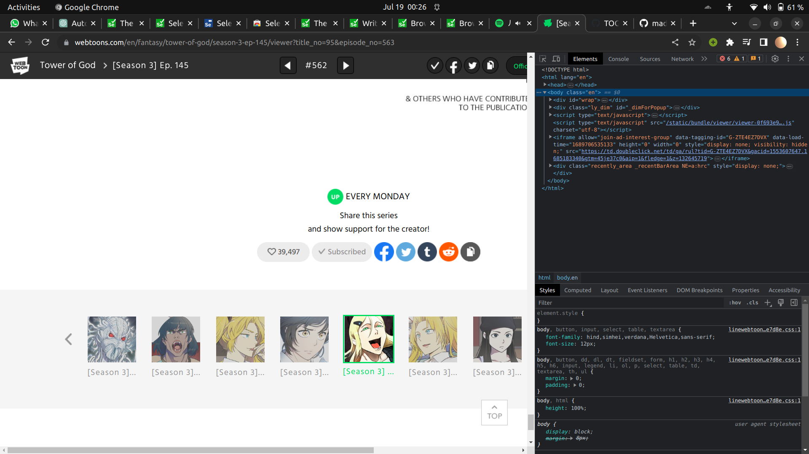
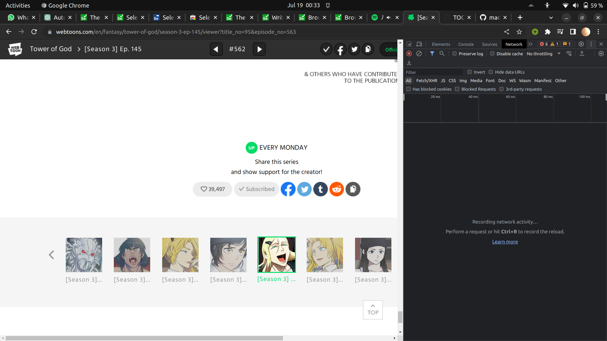
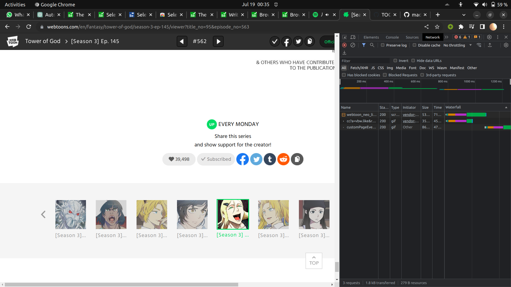

# Like all chapters of Tower of God!

Hello fellow TOG enjoyers!
Ever felt like you want to support TOG by liking all the chapters of the webtoon but found it too tiresome?
I did too! So, I made a script to automate it!

### Requirements
You need to have python installed on your machine to run this script. If you don't already it's pretty simple and you can find many tutorials for the same.

## Instructions for using the script

-> Download the script
simply download the script.py file or clone the repository if you want. 

### Find the http request for liking any chapter of TOG
This might be a bit complicated for people who have never tried web development. Still, with the instructions provided, it's pretty simple.

-> Log in on the webtoons website on chrome

-> Go to any chapter of TOG and let the page load completely
make sure you let the page finish loading before going to the next step as it may make it difficult to find the http request later.

-> Find the like button, and unlike the chapter if you have liked it already
make sure the chapter is not liked as it will be needed to get the correct http request.

-> Press F12 to go into developer mode
This will open a side panel in chrome which will look somewhat like this:

-> find the network tab
In the top of the developer options, you will find options like Elements, Console, Sources, Network etc.
Network will be the 4th option among these. Click on it.
If you are able to see only some of these options, click on '>>' to see other options or widen the developer mode tab. You will definitely find the Network tab now if didn't before.

It will look like this:

-> Like the chapter and check the already opened Network Tab
You'll see 3 requests in it.

-> Click on the first one which will be something like "webtoon_neo....".

You will find a huge Request URL as the first thing in it's details. Copy the whole <b>Request URL<b>. 

And the difficult part is over! Good job!!

### Running the Script

-> Find the Directory/Folder in which you downloaded the script file. Right Click on the folder and you'll see an option to open it in terminal. Click on it.

-> run the command:

    python3 script.py
If you get some error then try running the command without the '3'. If the issue persists, then there is some other problem. Contact me.

-> input the start chapter and the end chapter
No need to worry if you have liked some chapters before. Those will stay liked even after running this script.

-> paste the Request URL you copied before

And Done!!
You'll see the script running and printing "Liked chapter X".
If you get some error with a status code then contact me. 

